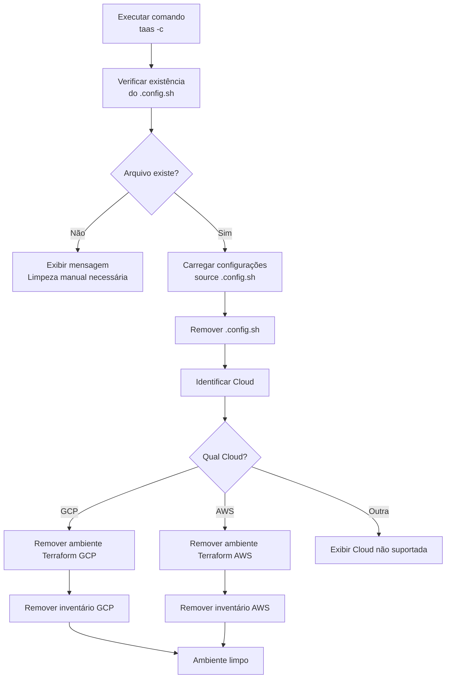
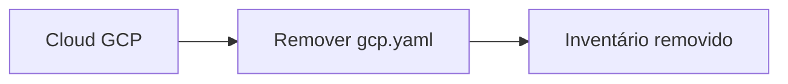
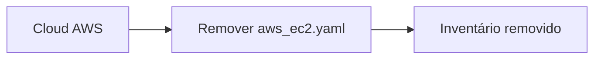
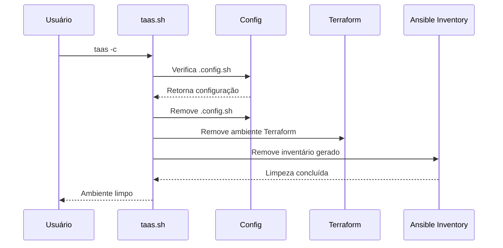

# Fluxo do Clean Environment

O comando `clean` realiza a limpeza dos arquivos locais gerados pelo TaaS, removendo configurações salvas, ambientes Terraform criados e inventários Ansible gerados.

## Objetivo

- Remover o arquivo de configuração do ambiente.
- Remover o diretório Terraform criado para o projeto.
- Remover inventários Ansible gerados.
- Voltar o repositório para um estado limpo para uma nova configuração.

---

# Fluxo



---

# Detalhamento das etapas

## 1. Execução

O usuário executa:

```bash id="p3v7nb"
taas -c
```

O `taas.sh` chama:

```bash id="y49c8q"
clean_environment
```

---

# 2. Validação do arquivo de configuração

O primeiro passo é verificar:

```bash id="k7j8pz"
.config.sh
```

Código:

```bash
if [ ! -f "$CONFIG_FILE" ]
```

---

## Caso não exista

Fluxo:

```text
Arquivo de configuração não encontrado.
Realizar limpeza manual.
```

O processo é encerrado.

---

# 3. Carregamento da configuração

Quando existe:

```bash id="upb6v1"
source .config.sh
```

São carregadas informações como:

```bash id="0vcmjo"
CLOUD
PROJECT_ID
```

Essas informações definem quais recursos locais serão removidos.

---

# 4. Remoção do arquivo de configuração

O arquivo:

```bash id="v1wz7d"
.config.sh
```

é removido:

```bash
rm $CONFIG_FILE
```

Após essa etapa, o ambiente perde as configurações persistidas.

---

# 5. Remoção do ambiente Terraform

O caminho base:

```bash
infra/terraform
```

é ajustado conforme a cloud:

```bash
TERRAFORM_PATH="$TERRAFORM_PATH/$CLOUD"
```

---

## GCP

Exemplo:

Antes:

```text
infra/
└── terraform/
    └── gcp/
        └── projeto-k6/
```

Após limpeza:

```bash
rm -rf infra/terraform/gcp/projeto-k6
```

---

## AWS

Exemplo:

Antes:

```text
infra/
└── terraform/
    └── aws/
        └── projeto-k6/
```

Após limpeza:

```bash
rm -rf infra/terraform/aws/projeto-k6
```

---

# 6. Remoção dos inventários Ansible

## GCP

Remove:

```bash
infra/ansible/playbooks/inventory/gcp.yaml
```

Fluxo:



---

## AWS

Remove:

```bash
infra/ansible/playbooks/inventory/aws_ec2.yaml
```

Fluxo:



---

# Fluxo de sequência



---

# Estrutura antes do clean

```text
taas/
├── .config.sh
│
├── infra/
│   ├── terraform/
│   │   └── gcp/
│   │       └── projeto-k6/
│   │
│   └── ansible/
│       └── playbooks/
│           └── inventory/
│               └── gcp.yaml
```

---

# Estrutura depois do clean

```text
taas/
│
├── infra/
│   ├── terraform/
│   │   └── gcp/
│   │
│   └── ansible/
│       └── playbooks/
│           └── inventory/
```

---

# Estrutura sugerida na versão 2.0

Esse fluxo deve ficar em:

```text
taas/
├── bin/
│   └── taas.sh
│
├── lib/
│   ├── config.sh
│   ├── terraform.sh
│   ├── ansible.sh
│   ├── clean.sh       <-- novo
│   ├── create.sh
│   ├── destroy.sh
│   ├── run.sh
│   ├── cmd.sh
│   └── upload.sh
│
└── config/
    └── .config.sh
```

Responsabilidade do módulo:

```bash
clean_environment(){
    load_config
    remove_config_file
    remove_terraform_workspace
    remove_ansible_inventory
}
```

O `taas.sh` fica apenas como roteador:

```bash
case "$OPTION" in

 c)
    clean_environment
    ;;

esac
```

Assim o **clean** fica independente do Terraform e Ansible, mas continua sendo o responsável por remover os artefatos gerados por eles.
