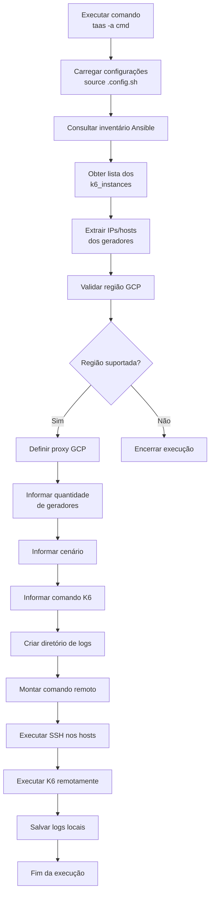
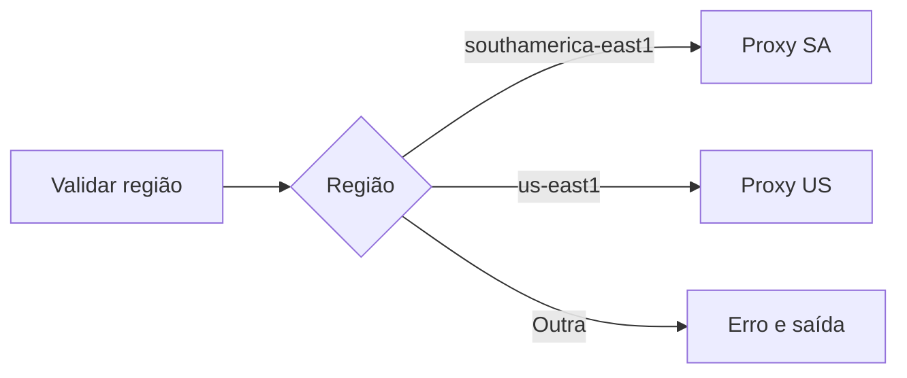
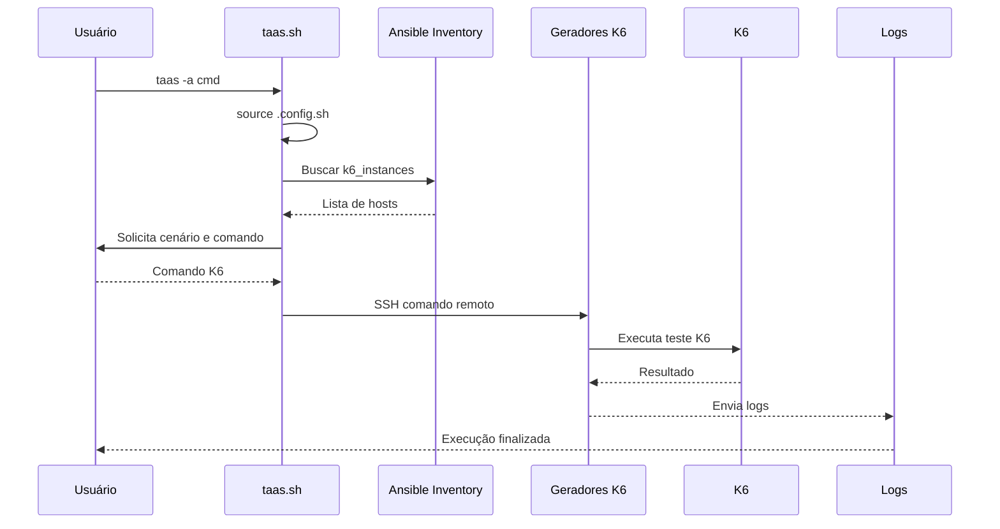

# Fluxo do CMD

O comando `cmd` permite executar comandos K6 diretamente nos geradores de carga já provisionados, utilizando SSH.

## Objetivo

- Descobrir os geradores de carga ativos.
- Permitir escolher quantas máquinas irão executar o comando.
- Montar o comando K6 com proxy e exportação de resultados.
- Executar remotamente nos hosts.
- Armazenar os logs da execução.

---

# Fluxo



---

# Detalhamento das etapas

## 1. Execução

O usuário executa:

```bash
taas -a cmd
```

O fluxo chama:

```bash
ansible_func cmd
```

---

# 2. Carregar configuração

O arquivo:

```bash
.config.sh
```

é carregado:

```bash
source $CONFIG_FILE
```

Variáveis utilizadas:

```bash
CLOUD
REGION
ANSIBLE_USER
K6_SOURCE_DIR
```

---

# 3. Descoberta dos geradores

O inventário Ansible é consultado:

```bash
ansible-inventory \
-i infra/ansible/playbooks/inventory/gcp.yaml \
--graph k6_instances
```

Exemplo de retorno:

```text
@k6_instances:
    k6-instance-001
    k6-instance-002
    k6-instance-003
```

O script transforma em uma lista:

```text
HOST_LIST

10.10.1.10
10.10.1.11
10.10.1.12
```

---

# 4. Configuração do proxy

O fluxo valida a região.

## South America

```bash
southamerica-east1
```

Utiliza:

```bash
PROXY_GCP_SA
```

Valor:

```text
http://proxy-sa-e1.gcp.i.globo:3128
```

---

## US East

```bash
us-east1
```

Utiliza:

```bash
PROXY_GCP_E1
```

Valor:

```text
http://proxy-us-e1.gcp.i.globo:3128
```

---

## Região não suportada

Fluxo:



---

# 5. Entrada do usuário

O script solicita:

### Quantidade de geradores

Exemplo:

```text
Em quantos geradores deseja executar?
Atual: 3
```

---

### Cenário

Exemplo:

```text
Informe o nome do cenário:

login
```

---

### Comando K6

Exemplo:

```bash
run -u 10 -d 5m login.js
```

---

# 6. Montagem do comando remoto

O comando final é construído:

```bash
sudo -u root bash -c '
cd /tmp/k6-performance-tests;

export NO_PROXY="...";

export HTTP_PROXY="proxy";

export HTTPS_PROXY="proxy";

/usr/local/sbin/k6 run \
-u 10 \
-d 5m \
login.js \
--summary-export /tmp/k6_results/login.json
'
```

---

# 7. Execução SSH

Para cada gerador:

```bash
ssh usuario@host comando
```

Exemplo:

```bash
ssh k6-user@10.10.1.10 "k6 run..."
```

---

# 8. Armazenamento dos logs

Estrutura criada:

```text
logs/
└── login/
    ├── 10.10.1.10-login.log
    ├── 10.10.1.11-login.log
    └── 10.10.1.12-login.log
```

Primeiro host:

```bash
tee
```

Demais hosts:

```bash
redirect >
```

---

# Fluxo de sequência



---

# Estrutura sugerida na versão 2.0

Esse fluxo deveria virar um módulo próprio:

```text
taas/
├── bin/
│   └── taas.sh
│
├── lib/
│   ├── config.sh
│   ├── terraform.sh
│   ├── ansible.sh
│   ├── cmd.sh        <-- novo
│   ├── upload.sh
│   └── utils.sh
│
└── config/
    └── .config.sh
```

Responsabilidade do módulo:

```bash
cmd_execute(){
    load_config
    get_k6_hosts
    build_k6_command
    execute_remote_command
    save_logs
}
```

O `taas.sh` apenas faria o roteamento:

```bash
case "$ACTION" in
    cmd)
        cmd_execute
        ;;
esac
```

Dessa forma o controle de execução manual do K6 fica separado do provisionamento Terraform e dos playbooks Ansible.
