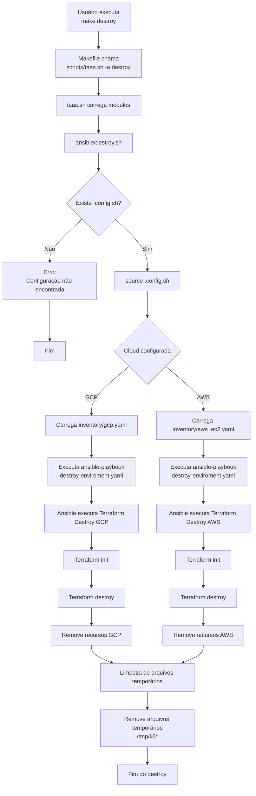

# Fluxo do Destroy

O comando `make destroy` remove a infraestrutura criada pelo TAAS.

Ele utiliza:

- `.config.sh` para identificar a cloud e o ambiente;
- inventários Ansible existentes;
- Ansible para executar a rotina de destruição;
- Terraform para remover os recursos provisionados.

## Fluxo



## Resumo do fluxo

```text
make destroy
      |
      v
scripts/taas.sh -a destroy
      |
      v
ansible/destroy.sh
      |
      v
Carrega .config.sh
      |
      +----------------+
      |                |
      v                v
     GCP              AWS
      |                |
      v                v
inventory/gcp.yaml   inventory/aws_ec2.yaml
      |                |
      +----------------+
              |
              v
destroy-enviroment.yaml
              |
              v
        Terraform
              |
              +-- init
              |
              +-- destroy
              |
              v
Infraestrutura removida
              |
              v
Limpeza de temporários
````

## Responsabilidades

| Componente           | Responsabilidade                  |
| -------------------- | --------------------------------- |
| `Makefile`           | Interface para executar o destroy |
| `taas.sh`            | Encaminha o comando               |
| `ansible/destroy.sh` | Executa a rotina de remoção       |
| `.config.sh`         | Identifica ambiente e cloud       |
| `inventory/*.yaml`   | Define os recursos alvo           |
| Terraform            | Remove os recursos provisionados  |
| Ansible              | Orquestra a execução              |

Estrutura da documentação:

```text
docs/
└── flows/
    ├── prepare-flow.md
    ├── create-flow.md
    └── destroy-flow.md
```

Uma observação: no seu código atual existe um `rm -rf /tmp/k6*` no final da função `ansible_func()`. Eu manteria isso documentado como **limpeza pós-destroy**, mas futuramente separaria para um comando próprio (`clean`) para evitar que uma falha parcial do destroy apague artefatos de diagnóstico.
