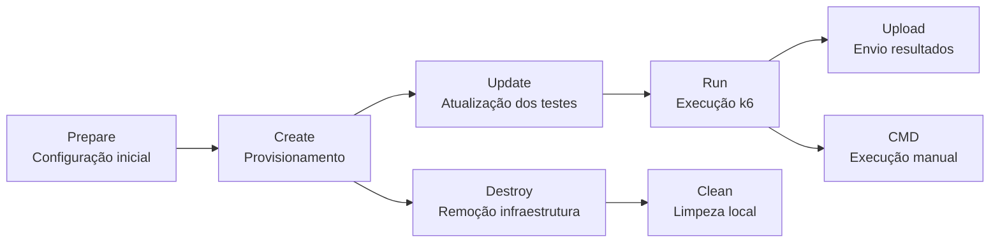
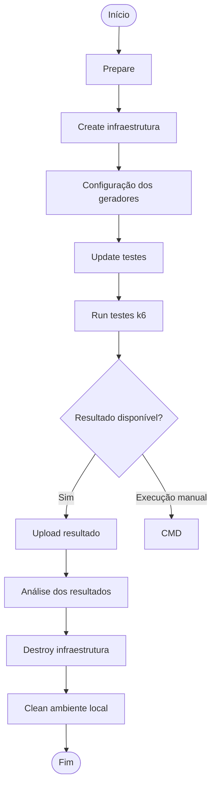
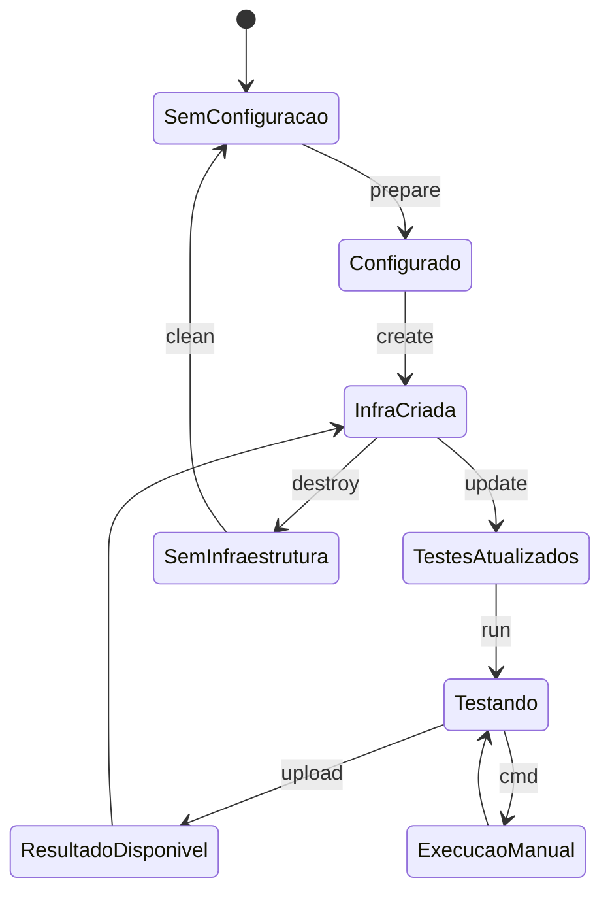

# Fluxos operacionais do TaaS

Este documento apresenta o resumo dos principais fluxos de execução do TaaS (Testing as a Service), separados por responsabilidade.

A arquitetura do fluxo foi dividida em etapas independentes para facilitar manutenção, entendimento e evolução do projeto.

---

## Visão geral

O TaaS possui os seguintes fluxos principais:

| Fluxo | Objetivo | Documento |
|---|---|---|
| Prepare | Preparação inicial do ambiente e geração das configurações | [prepare.md](./prepare.md) |
| Create | Provisionamento da infraestrutura utilizando Terraform e execução do Ansible | [create.md](./create.md) |
| Destroy | Remoção da infraestrutura provisionada | [destroy.md](./destroy.md) |
| Upload | Coleta dos resultados dos testes e envio para o Report | [upload.md](./upload.md) |
| Update | Atualização dos testes nos geradores de carga | [update.md](./update.md) |
| CMD | Execução de comandos diretamente nos geradores de carga | [cmd.md](./cmd.md) |
| Run | Execução das baterias de testes k6 | [run.md](./run.md) |
| Clean | Limpeza dos arquivos temporários e ambiente local | [clean.md](./clean.md) |

---

# Ciclo de vida do TaaS

---

# Fluxo recomendado de utilização

---

# Responsabilidade de cada fluxo

## Prepare

Responsável pela preparação inicial do ambiente:

- coleta informações da cloud;
- coleta dados de rede;
- define parâmetros Terraform;
- cria arquivo de configuração;
- gera variáveis utilizadas pelos demais fluxos.

Arquivo:

[prepare.md](./prepare.md)

---

## Create

Responsável pelo provisionamento:

- carrega configurações;
- prepara templates Terraform;
- substitui variáveis;
- cria infraestrutura;
- executa playbooks Ansible.

Arquivo:

[create.md](./create.md)

---

## Destroy

Responsável pela remoção dos recursos:

- carrega configuração existente;
- identifica cloud utilizada;
- executa playbook de destruição;
- remove infraestrutura criada.

Arquivo:

[destroy.md](./destroy.md)

---

## Upload

Responsável pelo envio dos resultados:

- coleta arquivos gerados pelo k6;
- prepara payload JSON;
- envia resultados para o Report;
- disponibiliza histórico dos testes.

Arquivo:

[upload.md](./upload.md)

---

## Update

Responsável pela atualização dos testes:

- acessa os geradores de carga;
- atualiza repositório dos testes;
- sincroniza branch configurada;
- prepara nova execução.

Arquivo:

[update.md](./update.md)

---

## CMD

Responsável pela execução manual:

- conecta nos geradores;
- executa comandos k6 diretamente;
- permite cenários personalizados;
- gera logs individuais.

Arquivo:

[cmd.md](./cmd.md)

---

## Run

Responsável pela execução das baterias:

- valida configuração do teste;
- define VUs e duração;
- seleciona cenários;
- executa playbook de performance;
- gera resultados.

Arquivo:

[run.md](./run.md)

---

## Clean

Responsável pela limpeza:

- remove arquivo de configuração;
- remove diretórios Terraform temporários;
- remove inventários gerados;
- deixa ambiente pronto para nova configuração.

Arquivo:

[clean.md](./clean.md)

---

# Estados do ambiente

---

# Comandos principais

| Comando | Função |
|---|---|
| `taas -p` | Prepare ambiente |
| `taas -a create` | Criar infraestrutura |
| `taas -a update` | Atualizar testes |
| `taas -a run` | Executar testes |
| `taas -a cmd` | Executar comando manual |
| `taas -a upload` | Enviar resultados |
| `taas -a destroy` | Destruir infraestrutura |
| `taas -c` | Limpar ambiente |

>Esse arquivo passa a ser o mapa da documentação, enquanto cada fluxo (prepare.md, create.md, etc.) fica responsável pelo detalhamento operacional.
