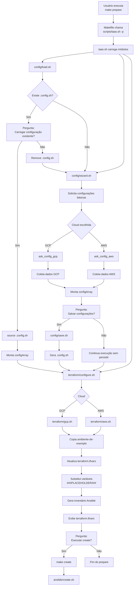

# Fluxo do Prepare

O comando `make prepare` inicializa a configuração do ambiente TAAS.

Ele é responsável por:

- coletar configurações da cloud;
- persistir variáveis no `.config.sh`;
- preparar arquivos Terraform;
- gerar inventários Ansible;
- opcionalmente iniciar a criação da infraestrutura.

## Fluxo



### Resumo do fluxo

```text
make prepare
      |
      v
taas.sh -p
      |
      v
Carrega configuração
      |
      +-- existe .config.sh?
      |       |
      |       +-- sim -> reutiliza configuração
      |
      +-- não -> wizard pergunta dados
                    |
                    +-- GCP
                    |     |
                    |     +-- dados de rede, projeto, VM
                    |
                    +-- AWS
                          |
                          +-- dados de VPC, subnet, credenciais

      |
      v
Salva .config.sh (opcional)
      |
      v
Configura Terraform
      |
      +-- cria ambiente
      +-- altera terraform.tfvars
      +-- gera inventário Ansible
      |
      v
Pergunta se cria infraestrutura
```

Eu colocaria essa documentação em algo como:

```text
docs/
└── flows/
    └── prepare-flow.md
```


Esse desenho também ajuda a validar a separação dos arquivos: se um bloco do diagrama não tem um arquivo correspondente, provavelmente ainda existe alguma responsabilidade misturada.

