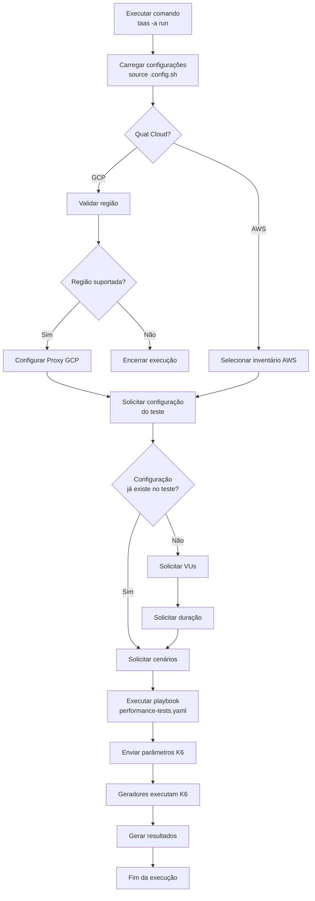
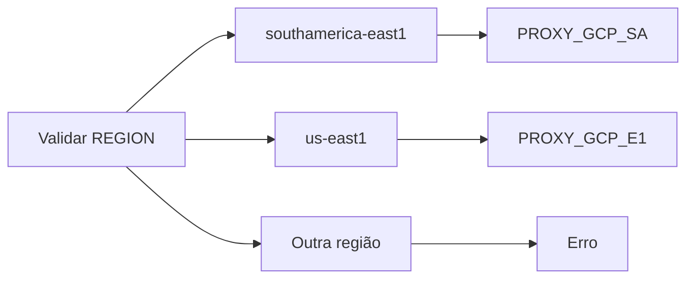
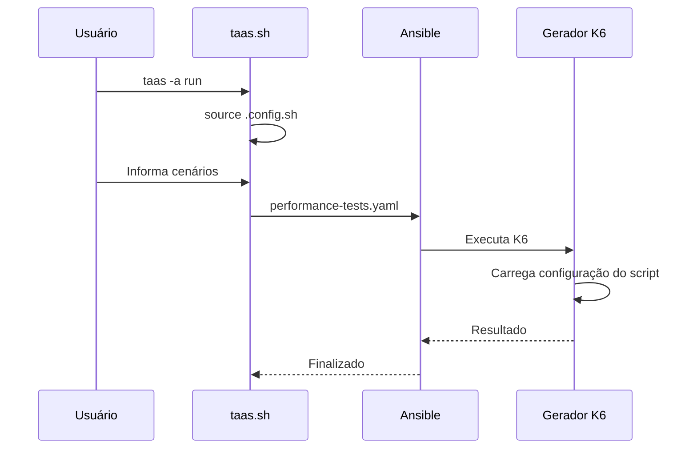
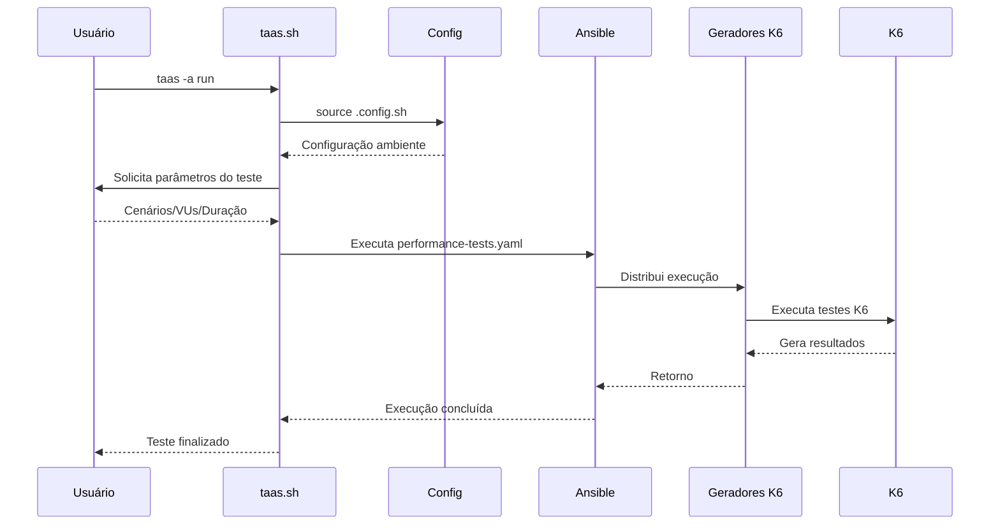

# Fluxo do Run

O comando `run` executa uma bateria de testes K6 nos geradores de carga provisionados utilizando Ansible.

## Objetivo

- Executar testes K6 distribuídos nos geradores.
- Permitir execução com configuração definida no script ou parâmetros informados no momento da execução.
- Suportar GCP e AWS.
- Gerar resultados para posterior upload no sistema de relatório.

---

# Fluxo



---

# Detalhamento das etapas

## 1. Execução

O usuário executa:

```bash
taas -a run
```

O fluxo chama:

```bash
ansible_func run
```

---

# 2. Carregar configuração

O arquivo:

```bash
.config.sh
```

é carregado:

```bash
source $CONFIG_FILE
```

Variáveis utilizadas:

```bash
CLOUD
REGION
ANSIBLE_USER
K6_REPO_TEST
K6_REPO_BRANCH
K6_SOURCE_DIR
```

---

# 3. Seleção da Cloud

O fluxo verifica:

```bash
CLOUD
```

## GCP

Executa:

```bash
performance-tests.yaml
```

com:

```bash
inventory/gcp.yaml
```

---

## AWS

Executa:

```bash
performance-tests.yaml
```

com:

```bash
inventory/aws_ec2.yaml
```

---

# 4. Configuração do Proxy GCP

Somente GCP utiliza proxy.

O script verifica a região:



---

# 5. Definição do modo de execução

O usuário informa:

```text
A configuração de VUs e duração já está presente no teste?
(s/n)
```

---

# 6. Execução com configuração no script

Quando:

```bash
K6_CONFIG_TEST=s
```

O usuário informa:

```text
Cenários de execução:

healthcheck.js,login.js
```

O Ansible recebe:

```bash
-e k6_script_config=true
-e k6_execution_tests=$K6_CENARIOS
```

---

Fluxo:



---

# 7. Execução com parâmetros informados

Quando:

```bash
K6_CONFIG_TEST=n
```

O usuário informa:

## Quantidade de usuários virtuais

Exemplo:

```text
10
```

Variável:

```bash
K6_VUS
```

---

## Duração

Exemplo:

```text
5m
```

Variável:

```bash
K6_DURATION
```

---

## Cenários

Exemplo:

```text
login.js
```

Variável:

```bash
K6_CENARIOS
```

---

O Ansible recebe:

```bash
-e k6_vus=$K6_VUS
-e k6_duration=$K6_DURATION
-e k6_execution_tests=$K6_CENARIOS
```

---

# 8. Execução do Ansible

## GCP

Comando:

```bash
ansible-playbook performance-tests.yaml \
-u $ANSIBLE_USER \
-e k6_proxy=$GCP_PROXY \
-e k6_vus=$K6_VUS \
-e k6_duration=$K6_DURATION \
-e k6_execution_tests=$K6_CENARIOS \
-i inventory/gcp.yaml
```

---

## AWS

Comando:

```bash
ansible-playbook performance-tests.yaml \
--key $ANSIBLE_USER \
-u ubuntu \
-e k6_vus=$K6_VUS \
-e k6_duration=$K6_DURATION \
-e k6_execution_tests=$K6_CENARIOS \
-i inventory/aws_ec2.yaml
```

---

# Fluxo completo de sequência



---

# Estrutura sugerida na versão 2.0

O fluxo deve ficar isolado:

```text
taas/
├── bin/
│   └── taas.sh
│
├── lib/
│   ├── config.sh
│   ├── terraform.sh
│   ├── ansible.sh
│   ├── create.sh
│   ├── destroy.sh
│   ├── run.sh          <-- novo
│   ├── cmd.sh
│   └── upload.sh
│
└── config/
    └── .config.sh
```

Responsabilidade:

```bash
run_tests(){
    load_config
    validate_cloud
    collect_execution_parameters
    execute_performance_playbook
}
```

O `taas.sh` fica apenas como dispatcher:

```bash
case "$ACTION" in

 run)
    run_tests
    ;;

esac
```

Assim o fluxo de execução dos testes fica desacoplado do provisionamento Terraform e da configuração inicial do ambiente.
