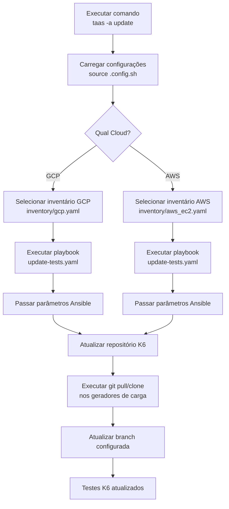
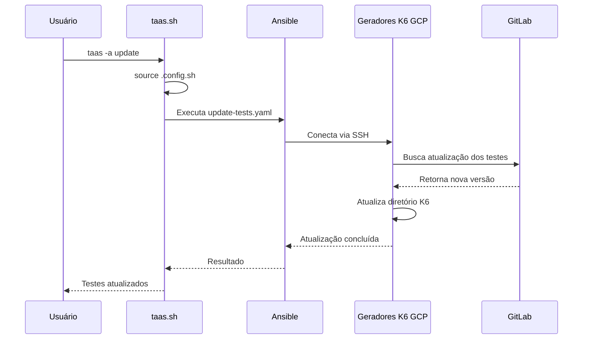
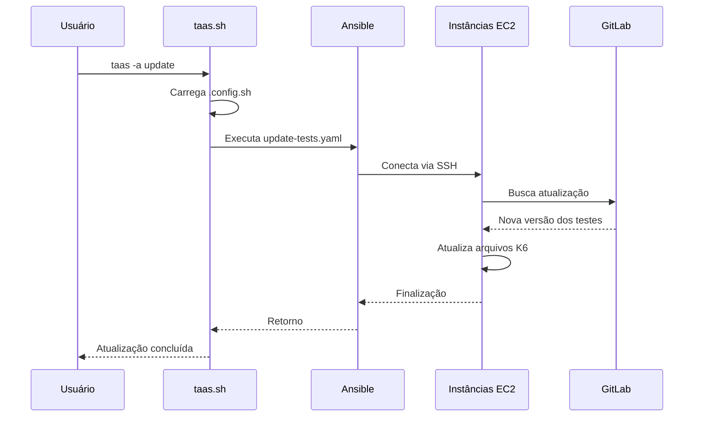

# Fluxo do Update

O comando `update` realiza a atualização dos testes K6 nos geradores de carga existentes, baixando a versão mais recente do repositório configurado.

## Objetivo

- Carregar as configurações do ambiente.
- Identificar a cloud utilizada (GCP ou AWS).
- Executar o playbook Ansible de atualização.
- Atualizar os testes K6 nos geradores de carga.

## Fluxo



---

# Detalhamento das etapas

## 1. Execução do comando

O usuário executa:

```bash
taas -a update
```

O `taas.sh` direciona para:

```bash
ansible_func update
```

---

## 2. Carregamento das configurações

O arquivo de configuração é carregado:

```bash
source .config.sh
```

Exemplo de variáveis utilizadas:

```bash
CLOUD=gcp
ANSIBLE_USER=usuario
K6_REPO_TEST=gitlab@gitlab.globoi.com:projeto/testes-k6.git
K6_REPO_BRANCH=master
K6_SOURCE_DIR=k6
```

---

# Fluxo GCP

Quando:

```bash
CLOUD=gcp
```

é executado:

```bash
cd infra/ansible/playbooks
```

Depois:

```bash
ansible-playbook update-tests.yaml \
-u $ANSIBLE_USER \
-e k6_instances_cloud_provider=gcp \
-e k6_repo_tests=$K6_REPO_TEST \
-e k6_repo_branch=$K6_REPO_BRANCH \
-e k6_tests_path=$K6_SOURCE_DIR \
-i inventory/gcp.yaml
```

Fluxo:



---

# Fluxo AWS

Quando:

```bash
CLOUD=aws
```

é executado:

```bash
ansible-playbook update-tests.yaml \
--key $ANSIBLE_USER \
-u ubuntu \
-e k6_instances_cloud_provider=aws \
-e k6_repo_tests=$K6_REPO_TEST \
-e k6_repo_branch=$K6_REPO_BRANCH \
-e k6_tests_path=$K6_SOURCE_DIR \
-i inventory/aws_ec2.yaml
```

Fluxo:



---

# Entradas utilizadas

| Variável       | Origem        | Uso                    |
| -------------- | ------------- | ---------------------- |
| CLOUD          | `.config.sh`  | Define GCP ou AWS      |
| ANSIBLE_USER   | `.config.sh`  | Usuário SSH            |
| K6_REPO_TEST   | `.config.sh`  | Repositório dos testes |
| K6_REPO_BRANCH | `.config.sh`  | Branch dos testes      |
| K6_SOURCE_DIR  | `.config.sh`  | Diretório dos testes   |
| inventory      | Infra Ansible | Lista dos hosts        |

---

# Estrutura na versão 2.0

Esse fluxo deveria ficar isolado em:

```text
taas/
├── bin/
│   └── taas.sh
│
├── lib/
│   ├── config.sh
│   ├── terraform.sh
│   ├── ansible.sh
│   ├── update.sh      <-- novo módulo
│   └── utils.sh
│
└── config/
    └── .config.sh
```

O `update.sh` teria apenas a responsabilidade:

```bash
update_tests(){
    carregar_config
    validar_cloud
    executar_playbook_update
}
```

O `taas.sh` ficaria somente como controlador:

```bash
case "$ACTION" in
   update)
       update_tests
       ;;
esac
```

Assim o update deixa de ficar acoplado ao fluxo de criação, execução e upload.
