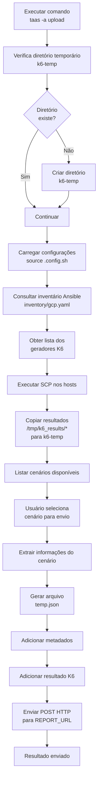

# Fluxo do Upload

O comando `upload` realiza a coleta dos resultados dos testes K6 executados nos geradores de carga, monta o payload esperado pela API de relatório e envia os resultados.

## Objetivo

- Buscar os arquivos de resultado (`k6_results`) nos geradores de carga.
- Permitir a seleção do cenário que será publicado.
- Montar o JSON de envio.
- Enviar o resultado para o serviço de relatório.

## Fluxo



## Detalhamento das etapas

### 1. Preparação do diretório temporário

O processo inicia verificando se existe o diretório:

```
k6-temp
```

Caso não exista, ele é criado.

---

### 2. Carregamento das configurações

O arquivo:

```
.config.sh
```

é carregado:

```bash
source $CONFIG_FILE
```

Exemplo de informações utilizadas:

```bash
REPORT_AREA
REPORT_PROJECT
ANSIBLE_USER
CLOUD
```

---

### 3. Descoberta dos geradores de carga

O inventário Ansible é consultado:

```bash
ansible-inventory \
-i infra/ansible/playbooks/inventory/gcp.yaml \
--graph k6_instances
```

A partir dele são obtidos os hosts responsáveis pela execução dos testes.

Exemplo:

```
k6-instance-001
k6-instance-002
k6-instance-003
```

---

### 4. Coleta dos resultados

O comando copia os resultados dos servidores:

```bash
scp $ANSIBLE_USER@$HOST_LIST:/tmp/k6_results/* k6-temp
```

Estrutura esperada:

```
k6-temp/
 ├── login.json
 ├── healthcheck.json
 └── checkout.json
```

---

### 5. Seleção do cenário

O usuário escolhe qual resultado será enviado:

Exemplo:

```
Escolha o cenário que será enviado para o report:

1 - login.json
2 - healthcheck.json
3 - checkout.json
```

---

### 6. Montagem do payload

É criado:

```
k6-temp/temp.json
```

Formato:

```json
{
  "colecao": "GloboID",
  "projeto": "Glive",
  "name": "login",
  "timestamp": "02/08/2026 - 10:30:00",
  "resultado": {
      ...
  }
}
```

Campos:

| Campo     | Origem          |
| --------- | --------------- |
| colecao   | REPORT_AREA     |
| projeto   | REPORT_PROJECT  |
| name      | Nome do cenário |
| timestamp | Data do arquivo |
| resultado | Resultado K6    |

---

### 7. Envio para API de relatório

O envio é realizado:

```bash
curl \
-X POST \
-H "Content-Type: application/json" \
-d @k6-temp/temp.json \
$REPORT_URL
```

Destino:

```
REPORT_URL
```

---

## Estrutura após o upload

```
taas
├── .config.sh
├── k6-temp
│   ├── login.json
│   ├── healthcheck.json
│   └── temp.json
└── logs
```

---

## Pontos de melhoria para a versão 2.0

Na nova arquitetura modular, este fluxo deveria ficar separado:

```
taas/
├── bin/
│   └── taas.sh
│
├── lib/
│   ├── config.sh
│   ├── terraform.sh
│   ├── ansible.sh
│   ├── upload.sh      <-- este fluxo
│   └── utils.sh
│
├── config/
│   └── .config.sh
```

O comando principal ficaria apenas como roteador:

```bash
taas -a upload
```

chamando:

```bash
source lib/upload.sh
upload_results
```

Assim o `taas.sh` deixa de conhecer detalhes de K6, SCP e API de relatório.
